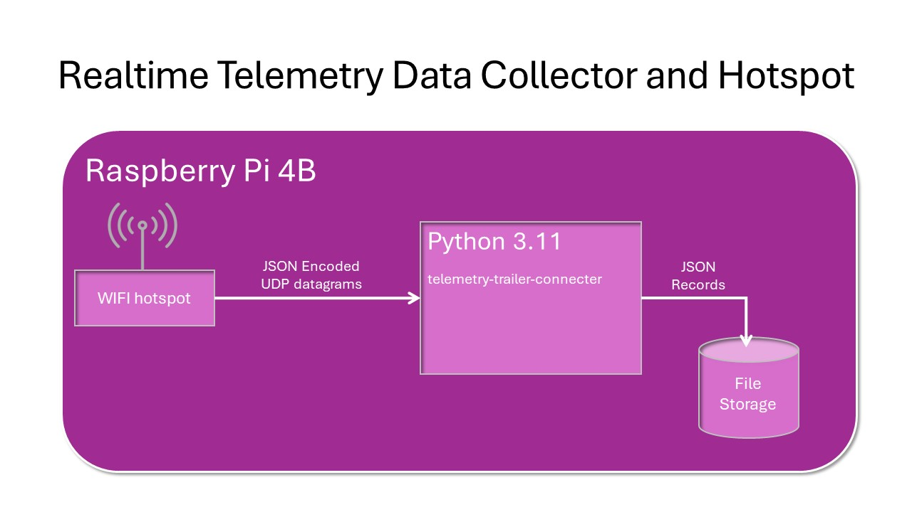
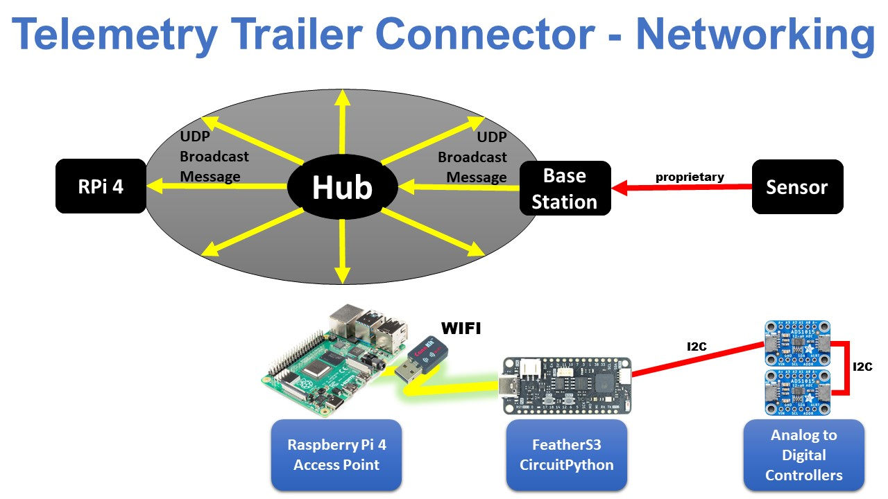

# Telemetry Trailer Connector

On tow vehicles, 7-Way Trailer Connectors are used to determine brakes (on/off), brake controller output (brake pressure), lights (on/off) and reverse (engaged/not engaged).  The wiring and applications also support 4-Way Trailer Connectors.  The 4-Way Connectors can only provide taillights, right/left blinkers and brake light signals.

## **UNDER CONSTRUCTION**

## Context Diagram

### Telemetry Trailer Connecter Context Diagram


### Realtime Telemetry Data Collector and Hotspot

#### Target System

The software is being tested on a Raspberry Pi 4 (or 5) running Raspberry Pi OS ```bookworm```.

#### Target Hardware

Raspberry Pi 4 with 4 GB RAM (or more) and with a 32 GB (or more) SD card.



### WIFI Enabled Microcontroller/Sensors


### Wiring Diagram


## Motivation

Integrate brake use information with vehicle engine, motion, wind and location data for better, more accurate analytics.

At any speed, brake use slows vehicle motion and is material in fuel usage.

## Features

* When using 7 pin trailer connectors, brake activation and brake pressure is logged.
* When using 4 pin trailer connectors, brake activation is logged.

## Hardware

### Unexpected Maker FeatherS3

The [Unexpected Maker FeatherS3](https://unexpectedmaker.com/shop.html#!/FeatherS3/p/577111310/category=0) features:

* ESP32-S3 Chip
* Supports WIFI and Bluetooth
* Supports I2C Bus with QWIIC/STEMMA QT Connectors
* Well Supported with Examples and Documentation
* Inexpensive

#### Adafruit ADS1015 Analog to Digital Converter (ADC) Breakout Board

[Adafruit ADS1015 Analog to Digital Converter (ADC) Breakout Board](https://www.adafruit.com/product/1083) features:

* 4 ADC channels
* Supports I2C Bus with QWIIC/STEMMA QT Connectors
* Supports Chaining I2C Bus and Using Up to 4 ADC Breakout Boards (16 Total Channels)
* Well Supported with Examples and Documentation
* Inexpensive

### Raspberry Pi Model 4B 4 GB Ram

## Modules

### Development System

Development systems must be full blown computers running Windows, Mac, Linux or Raspberry Pi OS.  For testing and making software changes directly on a FeatherS3 or other CircuitPython capable microcontroller, we recommend the [Mu Editor](https://codewith.mu/) be installed and used for FeatherS3 CircuitPython development.

Get this repository:

```bash
git clone https://github.com/thatlarrypearson/telemetry-trailer-connector.git
```

The development system can also be the deployment system.

### Raspberry Pi Deployment System Installation

The recommended Raspberry Pi system is a Raspberry Pi 4 Model B, Raspberry Pi 400 or Raspberry Pi 5 with 4 GB RAM or more. The full 64 bit release of Raspberry Pi OS version 12 (bookworm) or newer, including the GUI is the recommended operating system. When choosing a Micro-SD card for storage, look for Internet resources like Best microSD Cards for Raspberry Pi & SBCs as a guide to making an appropriate selection. Select cards 32 GB or larger.

After installing Raspberry Pi OS on a Raspberry Pi 4 computer, update the operating system to the newest version. One way to do this is as follows:

```bash
# update and upgrade Linux/Raspberry Pi OS
sudo apt-get update
sudo apt-get upgrade -y
sudo apt-get autoremove -y
sudo shutdown -r now
sudo apt-get dist-upgrade -y
sudo shutdown -r now
```

Install useful software:

```bash
# git software
sudo apt-get install -y git
```

Validate that your Raspberry Pi has Python version 3.11 available:

```bash
# Python 3 version
human@hostname:~$ python3 --version
Python 3.6.9
# Python 3.11 version
human@hostname:~$ python3.11 --version
Python 3.11.5
human@hostname:~$
```

The latest Raspberry Pi OS version Bookworm (12.2), ships with Python 3.11 but don't use it. It has a new feature that will prevent you from using pip to download necessary Python packages. Instead, download/make/install Python 3.11 from source using these [Python 3.11 Installation Instructions](https://github.com/thatlarrypearson/telemetry-obd#raspberry-pi-system-installation)

On the development system (Linux/Windows/Mac/Raspberry Pi OS), install [```circup```](https://pypi.org/project/circup/#toc-entry-1). ```circup``` will be used to install required CircuitPython libraries onto the FeatherS3.

```bash
python3.11 -m pip install circup
```

Before installing this software, the [Telemetry System Boot and Application Startup Counter](https://github.com/thatlarrypearson/telemetry-counter) application must be installed using these [instalation instructions](https://github.com/thatlarrypearson/telemetry-counter#installation).

If you haven't done so already, clone this repository.

```bash
git clone https://github.com/thatlarrypearson/telemetry-trailer-connector.git
```

Next, install this application.

```bash
cd
cd telemetry-trailer-connector/
python3.11 -m build
python3.11 -m pip install --user dist/telemetry_trailer_connector-0.0.0-py3-none-any.whl
chmod 0755 bin/*.sh
cd
```

#### Raspberry Pi WIFI Network Configuration

In order to receive data from the FeatherS3 microcontroller, the deployment system and the FeatherS3 need to be on the same LAN (local area network).  The following network context diagram provides two network views.  The first view shows the FeatherS3 sending UDP broadcast messages to the deployment system on the local network.  When the deployment computer on the LAN actively listens for broadcast messages on a specific port, ti can process these messages.  Otherwise, the messages will be discarded.


The second view shows more of a hardware view.  Weather data originates from WeatherFlow Tempest sensors and is transmitted to a WeatherFlow Tempest base station via a proprietary communications method.  Using a smart phone application, the base station is configured to use WIFI provided by the computer running this software, a Raspberry Pi 4 Model B.  This Raspberry Pi provided local area network behaves like a normal WIFI/hotspot/router that may or may not be connected via Ethernet to the Internet through an optional WIFI/hotspot/router.



This method is being used for automotive trailer connector data collection.  Configuring a WIFI Access Point on a Raspberry Pi 4 running ```Debian 12 bookworm``` is tricky because, in this latest release of Raspberry Pi, network configuration has been dramatically changed to a new configuration subsystem called [Network Manager](https://networkmanager.dev/).   More rough spots need to be smoothed out. **Beware** - documentation regarding how to create a WIFI access point found on the Internet often refers to the old way of configuring networks.

Follow the instructions found in [Configuring Raspberry Pi WIFI/Hotspot/Router](https://github.com/thatlarrypearson/telemetry-wthr/blob/main/docs/wifi-hotspot-router.md).  If, during the creation/configuration of the hotspot, changes are made, be aware that corresponding changes will need to be made in FeatherS3 CircuitPython application.

Once you have a hotspot up and running, the FeatherS3 needs to be configured to work with the in-vehicle hotspot.  Follow the instructions provided below in the  [FeatherS3 Circuit Python Application Configuration](#feathers3-circuit-python-application-configuration) section.

#### Raspberry Pi: Starting Application on System Start (Boot)

In order to reliably run in an automotive environment, the Trailer Connector Logger application (```telemetry-trailer-connector/trlr_logger/trlr_logger.py) needs to start automatically every time the Raspberry Pi powers on.  The application must start without any user interaction.

##### ```/etc/rc.local```

On the Raspberry Pi, commands embedded in "```/etc/rc.local```" will be run at the end of the system startup sequence by the ```root``` user.  A sample "```/etc/rc.local```" follows:

```bash
#!/bin/sh -e
#
# rc.local
#
# This script is executed at the end of each multiuser runlevel.
# Make sure that the script will "exit 0" on success or any other
# value on error.
#
# In order to enable or disable this script just change the execution
# bits.
#
# By default this script does nothing.

# Print the IP address
_IP=$(hostname -I) || true
if [ "$_IP" ]; then
  printf "My IP address is %s\n" "$_IP"
fi

# BEGIN TELEMETRY-TRLR SUPPORT

/bin/nohup "/root/bin/telemetry.rc.local.trlr" &

# END TELEMETRY-TRLR SUPPORT

exit 0
```

```/etc/rc.local``` invokes ```/root/bin/telemetry.rc.local```.  The functionality in ```/root/bin/telemetry.rc.local``` is not placed in ```/etc/rc.local``` for these reasons:

* Rasberry Pi OS (```Bullseye```) invokes /etc/rc.local with ```/bin/sh``` (soft link to ```/bin/dash```) which is not the same as ```/usr/bin/bash```, the required shell.
* ```/bin/sh``` is invoked with ```-e``` flag meaning that ```/etc/rc.local``` will stop execution when a pipe fails.  See [bash documentation](https://www.gnu.org/software/bash/manual/bash.pdf).

##### ```telemetry-trailer-connector/root/bin/telemetry.rc.local.trlr```

```telemetry-trailer-connector/root/bin/telemetry.rc.local.trlr``` must be run as root.  It will invoke ```bin/trlr_logger.sh``` which invokes ```trlr_logger.py``` provided in this distribution.

Shell variables, like ```TRLR_USER``` must be changed in ```root/bin/telemetry.rc.local.trlr``` to match the target system.

The ```runuser``` command in "```telemetry-obd/root/bin/telemetry.rc.local.trlr```" file runs the "```telemetry-trailer-connector/bin/trlr_logger.sh```" ```bash``` shell program as user "```human```" and group "```dialout```".

Once the ```telemetry-trailer-connector/root/bin/telemetry.rc.local.trlr``` file has been modified, it must be copied to ```/root/bin``` and the file permissions changed:

```bash
cd
cd telemetry-trailer-connector/root/bin
sudo mkdir /root/bin
sudo cp telemetry.rc.local.trlr /root/bin
sudo chmod 0755 /root/bin/telemetry.rc.local.trlr
sudo ls -l /root/bin/telemetry.rc.local.trlr
cd
```

Make ```trlr_logger.sh```:

```bash
cd
cd telemetry-trailer-connector/bin
chmod +x trlr_logger.sh
cd
 ```

#### Manually Starting ```trlr_logger.trlr_logger```

To get the command line flags from the application:

```bash
$ python -m trlr_logger.trlr_logger --help
usage: trlr_logger.py [-h] [--udp_port_number UDP_PORT_NUMBER] [--log_file_directory LOG_FILE_DIRECTORY]
                      [--verbose] [--version]
                      [base_path]

Telemetry Trailer Connector UDP Logger

positional arguments:
  base_path             Relative or absolute output data directory. Defaults to '/home/lbp/telemetry-data/data'.

options:
  -h, --help            show this help message and exit
  --udp_port_number UDP_PORT_NUMBER
                        TCP/IP UDP port number for receiving datagrams. Defaults to '50223'
  --log_file_directory LOG_FILE_DIRECTORY
                        Place log files into this directory - defaults to /home/lbp/telemetry-data/data
  --verbose             Turn DEBUG logging on. Default is off.
  --version             Print version number and exit.
$ 
```

The default ```UDP_PORT_NUMBER``` is coded into the Raspberry Pi Python application and also into the FeatherS3 Circuit Python application configuration.  See the section on [FeatherS3 Circuit Python Application Configuration](#feathers3-circuit-python-application-configuration)

#### Data File Format

The data file format is in the same data file format as is found in the [telemetry-obd](https://github.com/thatlarrypearson/telemetry-obd) application.

Output data files are in a hybrid format.  Data files contain records separated by line feeds (```LF```) or carriage return and line feeds (```CF``` and ```LF```).  The records themselves are formatted in JSON.  Sample output follows:

```python
{
    "command_name": "tc47pin",
    "obd_response_value": {
            "sequence_number": 6804,
            "gain0": 1,
            "gain1": 1,
            "blue_brakes_7": 0.606018,
            "brown_taillights_7": 0.606018,
            "yellow_left_stop_7": 0.610018,
            "green_right_stop_7": 0.604018,
            "purple_backup_7":  0.604018,
            "brown_taillights_4": 0.604018,
            "yellow_left_stop_4":  0.604018,
            "green_right_stop_4":  0.604018,
        },
    "iso_ts_pre": "2024-09-19T14:51:18.503813+00:00",
    "iso_ts_post": "2024-09-19T14:51:19.323545+00:00"
}<CR>
```

#### JSON Fields

- ```command_name```
  Specific to the [Telemetry Trailer Connector](https://github.com/thatlarrypearson/telemetry-trailer-connector) application.  The value should always be ```tc47pin```.

- ```obd_response_value```
  OBD response values returned by the Analog to Digital Converters (ADC) in a dictionary as shown above.

  ```sequence_number``` is a count of the number of records sent by the FeatherS3 since the FeatherS3 booted.

  ```gain0``` and ```gain1``` is the voltage gain setting in each ADC.  A value of 1 (default) represents a range of 4.096 Volts.  Resisters (see the Wiring Diagram) drop the vehicle's voltage from 12 VDC seen to the 4.096 range to put the voltage into the right range for ADCs.
  
  7 pin connector ```blue_brakes_7```, ```brown_taillights_7```, ```yellow_left_stop_7```, ```green_right_stop_7```, ```purple_backup_7```

  4 pin connector ```brown_taillights_4```, ```yellow_left_stop_4```, ```green_right_stop_4```

  With this application, the returned values represent scaled voltages for each signal presented by the vehicle's trailer hitch connector.  See the wiring diagram.

- ```iso_ts_pre```
  ISO formatted timestamp taken before ADC sampling (```datetime.isoformat(datetime.now(tz=timezone.utc))```).

- ```iso_ts_post```
  ISO formatted timestamp taken after after ADC sampling (```datetime.isoformat(datetime.now(tz=timezone.utc))```).

### Verbose (Debug) Output

Using the ```--verbose``` flag on the command line (as shown below) turns on detailed logging which has been helpful in debugging coding and configuration issues.

```bash
lbp@telemetry4:~/telemetry-trailer-connector $ python3.11 -m tc_logger.udp_logger --verbose
DEBUG:tc_logger:argument --verbose: True
INFO:tc_logger:log_file_directory: /home/lbp/telemetry-data/data
INFO:tc_logger:log file full path: /home/lbp/telemetry-data/data/telemetry4/telemetry4-0000000000-tc-0000000006.json
ERROR:tc_logger:get_log_file_handle(): FileExistsError: /home/lbp/telemetry-data/data/telemetry4/telemetry4-0000000000-tc-0000000006.json
ERROR:tc_logger:get_log_file_handle(): Incremented 'tc' counter to 7
INFO:tc_logger:log file full path: /home/lbp/telemetry-data/data/telemetry4/telemetry4-0000000000-tc-0000000007.json
INFO:tc_logger:UDP client ready on 0.0.0.0 port 50223
DEBUG:tc_logger:1 address: ('192.168.2.42', 64589)
```

```
DEBUG:tc_logger:2449 address: ('192.168.2.42', 64589)
DEBUG:tc_logger:2449 message: b'{"ads0/2": {"voltage": 0.610018, "raw_value": 4576}, "ads0/3": {"voltage": 0.608018, "raw_value": 4640}, "gain0": 1, "sequence_number": 6620, "ads0/0": {"voltage": 0.606018, "raw_value": 4592}, "ads0/1": {"voltage": 0.608018, "raw_value": 4576}}'
DEBUG:tc_logger:raw record: {'ads0/2': {'voltage': 0.610018, 'raw_value': 4576}, 'ads0/3': {'voltage': 0.608018, 'raw_value': 4640}, 'gain0': 1, 'sequence_number': 6620, 'ads0/0': {'voltage': 0.606018, 'raw_value': 4592}, 'ads0/1': {'voltage': 0.608018, 'raw_value': 4576}}
DEBUG:tc_logger:logging: {'command_name': 'tc47pin', 'obd_response_value': {'blue_brakes_7': 0.606018, 'brown_taillights_7': 0.608018, 'yellow_left_stop_7': 0.610018, 'green_right_stop_7': 0.608018}, 'iso_ts_pre': '2024-09-19T15:25:02.245642+00:00', 'iso_ts_post': '2024-09-19T15:25:03.069117+00:00'}
DEBUG:tc_logger:2450 address: ('192.168.2.42', 64589)
DEBUG:tc_logger:2450 message: b'{"ads0/2": {"voltage": 0.604018, "raw_value": 4608}, "ads0/3": {"voltage": 0.606018, "raw_value": 4672}, "gain0": 1, "sequence_number": 6621, "ads0/0": {"voltage": 0.610018, "raw_value": 4544}, "ads0/1": {"voltage": 0.606018, "raw_value": 4624}}'
DEBUG:tc_logger:raw record: {'ads0/2': {'voltage': 0.604018, 'raw_value': 4608}, 'ads0/3': {'voltage': 0.606018, 'raw_value': 4672}, 'gain0': 1, 'sequence_number': 6621, 'ads0/0': {'voltage': 0.610018, 'raw_value': 4544}, 'ads0/1': {'voltage': 0.606018, 'raw_value': 4624}}
DEBUG:tc_logger:logging: {'command_name': 'tc47pin', 'obd_response_value': {'blue_brakes_7': 0.610018, 'brown_taillights_7': 0.606018, 'yellow_left_stop_7': 0.604018, 'green_right_stop_7': 0.606018}, 'iso_ts_pre': '2024-09-19T15:25:03.075270+00:00', 'iso_ts_post': '2024-09-19T15:25:03.900665+00:00'}
```

### FeatherS3 Circuit Python Version

The FeatherS3 CircuitPython version should be ```8.3``` or greater.  Plug the FeatherS3 into the development system with a USB cable.  The device should automatically mount as a USB drive.

On Unix/Linux/Mac using bash:

```bash
lbp@telemetry4:~ $ cd /media/lbp/CIRCUITPY/
lbp@telemetry4:/media/lbp/CIRCUITPY $ ls -l
total 18
-rw-r--r-- 1 lbp lbp  122 Dec 31  1999  boot_out.txt
-rw-r--r-- 1 lbp lbp 3233 Sep 20 08:29  code.py
-rw-r--r-- 1 lbp lbp 2130 Jun 30  2023  feathers3.py
drwxr-xr-x 4 lbp lbp 2048 Dec 31  1999  lib
-rw-r--r-- 1 lbp lbp  375 Sep 19 03:46  settings.toml
drwxr-xr-x 2 lbp lbp 2048 Aug  8 09:04 'System Volume Information'
-rw-r--r-- 1 lbp lbp  455 Jun 30  2023  test_results.txt

lbp@telemetry4:/media/lbp/CIRCUITPY $ cat boot_out.txt
Adafruit CircuitPython 8.1.0 on 2023-05-22; FeatherS3 with ESP32S3
Board ID:unexpectedmaker_feathers3
UID:CEADB314FB44
lbp@telemetry4:/media/lbp/CIRCUITPY $ 
```

On Windows Using PowerShell:

```powershell
PS C:\Users\lbp> e:
PS E:\> dir


    Directory: E:\


Mode                 LastWriteTime         Length Name
----                 -------------         ------ ----
d-----        12/31/1999  11:00 PM                .fseventsd
d-----        12/31/1999  11:00 PM                lib
-a----        12/31/1999  11:00 PM              0 .metadata_never_index
-a----        12/31/1999  11:00 PM              0 .Trashes
-a----         9/20/2024   1:29 PM           3233 code.py
-a----        12/31/1999  11:00 PM            122 boot_out.txt
-a----         6/30/2023   6:11 AM           2130 feathers3.py
-a----         6/30/2023   6:11 AM            455 test_results.txt
-a----         9/19/2024   8:46 AM            375 settings.toml


PS E:\> type boot_out.txt
Adafruit CircuitPython 8.1.0 on 2023-05-22; FeatherS3 with ESP32S3
Board ID:unexpectedmaker_feathers3
UID:CEADB314FB44
PS E:\>
```

#### FeatherS3 Software Installation

These installation instructions assume a development and/or a deployment system is going to be used to install the necessary software on the FeatherS3.

From the deployment system, using ```circup```, install [adafruit_ads1x15](https://docs.circuitpython.org/projects/ads1x15/en/latest/) and [adafruit_bus_device](https://docs.circuitpython.org/projects/busdevice/en/latest/api.html).  If the ```circup``` command isn't found, follow the install instructions above for ```circup``` to get the path to the executable.

Attach the FeatherS3 to the development system using a USB cable.

```bash
circup install adafruit_ads1x15
```

#### FeatherS3 Circuit Python Application Configuration
