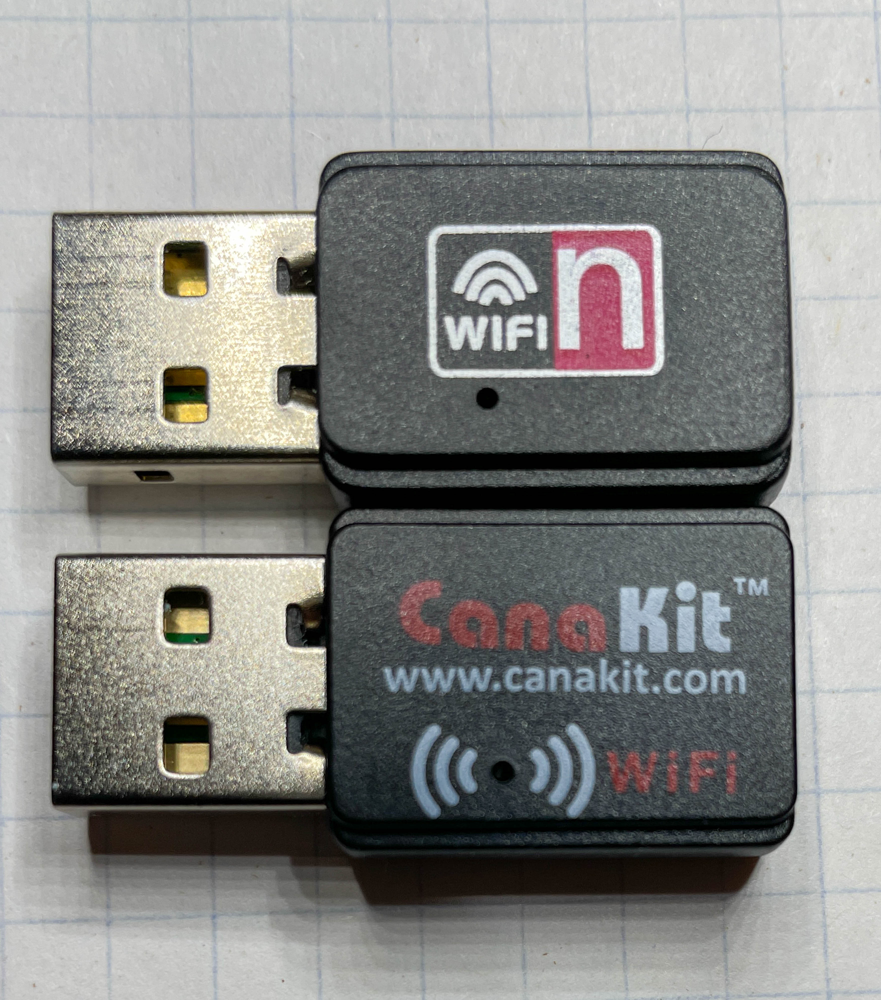
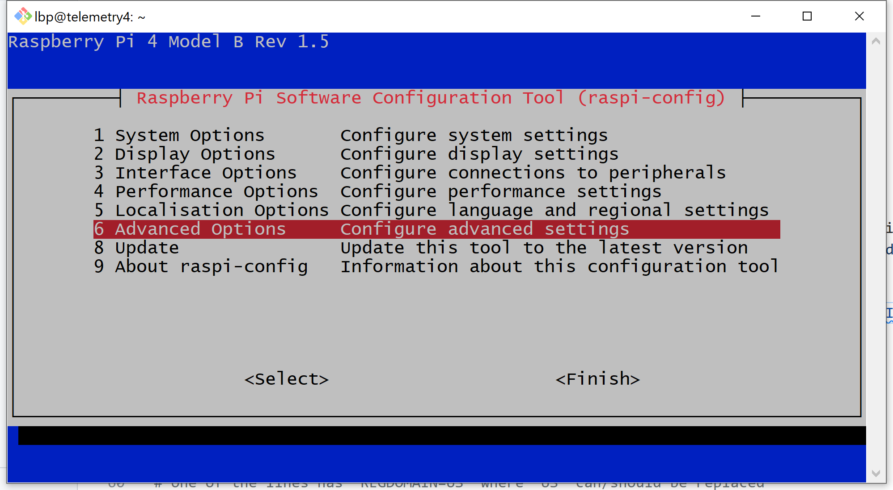
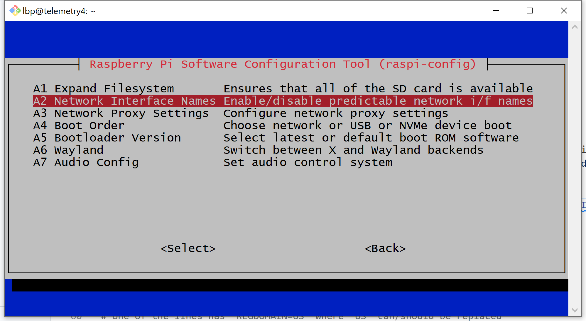
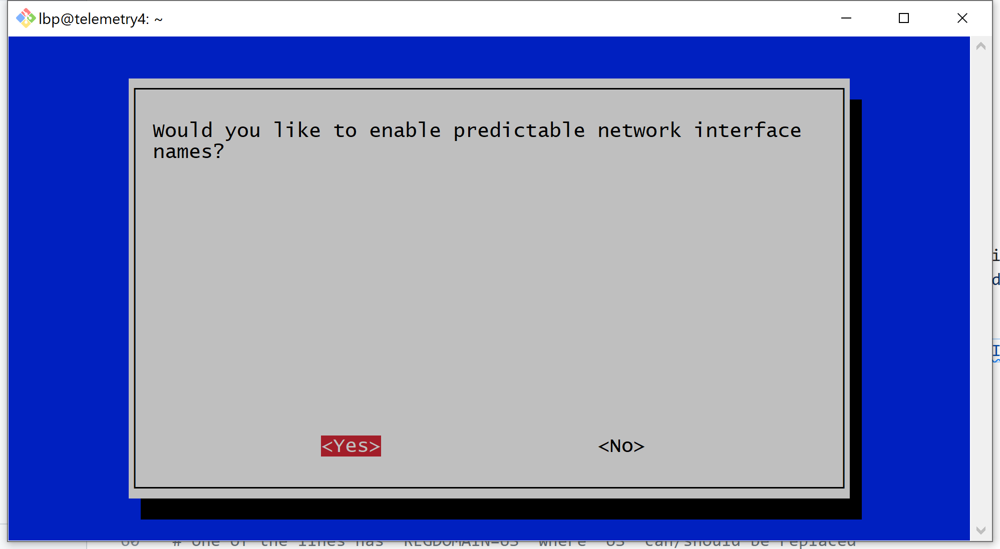
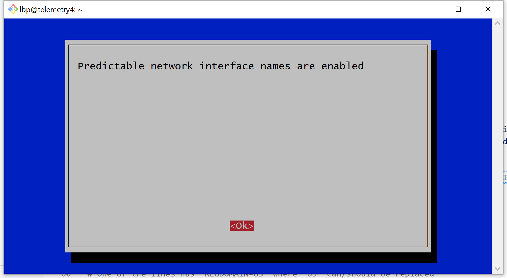
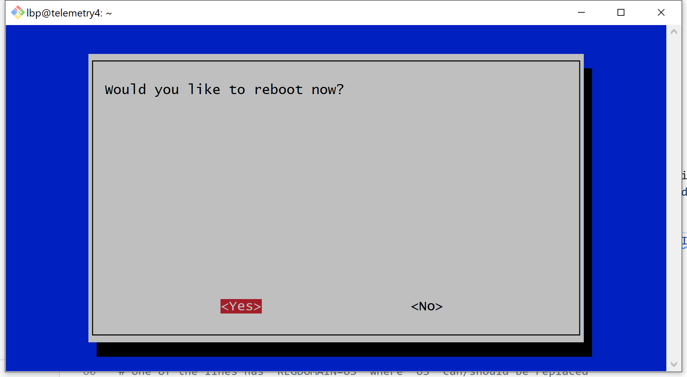
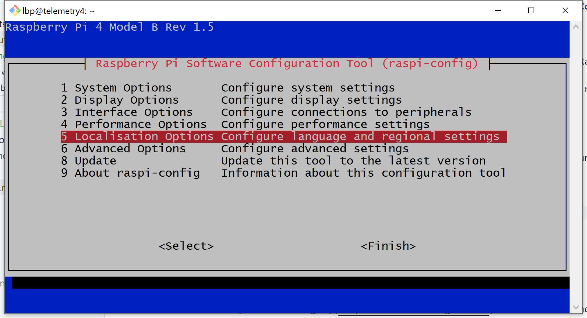
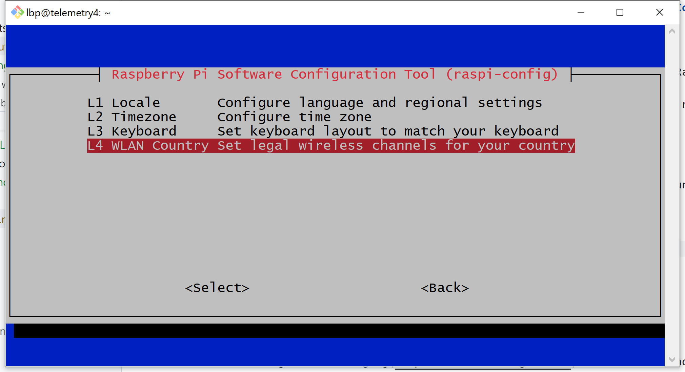
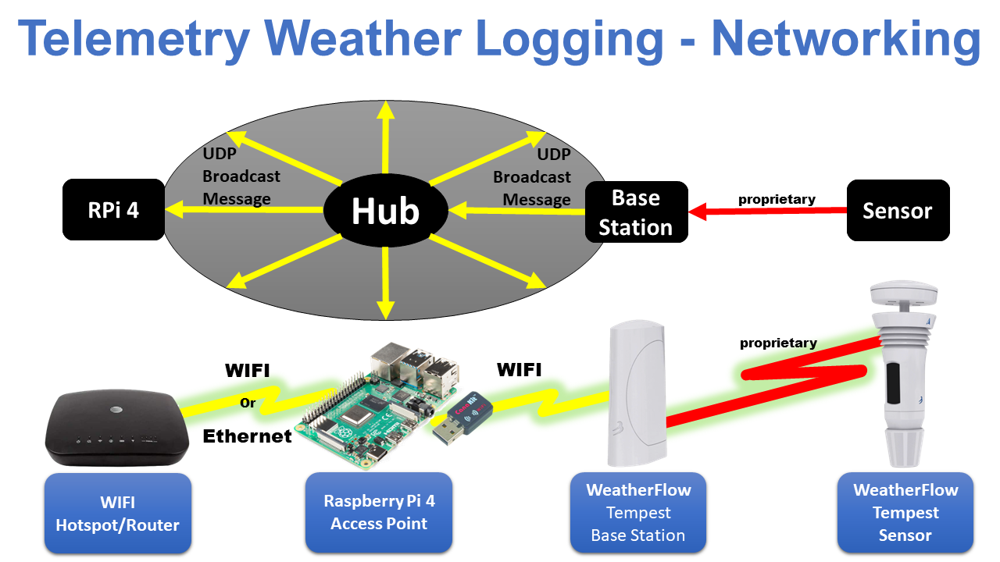
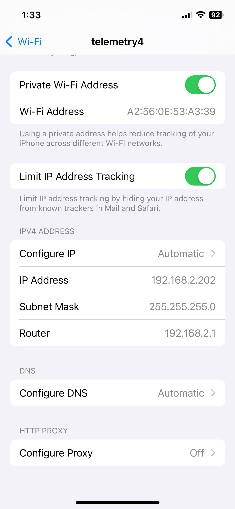

# Raspberry Pi OS Bookworm 12.4 Access Point Configuration

Raspberry Pi OS has recently changed the way Internet network connections are configured.  Most sources on the Internet still reflect the older configuration methods making it extremely difficult for people new to Linux to configure a working Access Point (AP), also called a WIFI hotspot.  The following instructions, although tedious, should allow anyone with modest computer skills to successfully configure an AP (WIFI hotspot) on their Raspberry Pi.

The following Access Point (AP) (WIFI/Hotspot/Router) configuration instructions only apply to the Debian variant Raspberry Pi OS Bookworm version 12.4 or newer.

## **Under Construction**

## Operating System Version Check

Check your operating system version information to make certain that your system shows the following or something more recent:

* ```/etc/debian_version``` shows ```12.4```
* ```/etc/os-release``` shows ```VERSION="12 (bookworm)"```

```bash
lbp@telemetry4:~ $ cat /etc/debian_version
12.4
lbp@telemetry4:~ $
```

```bash
lbp@telemetry4:~ $ cat /etc/os-release
PRETTY_NAME="Debian GNU/Linux 12 (bookworm)"
NAME="Debian GNU/Linux"
VERSION_ID="12"
VERSION="12 (bookworm)"
VERSION_CODENAME=bookworm
ID=debian
HOME_URL="https://www.debian.org/"
SUPPORT_URL="https://www.debian.org/support"
BUG_REPORT_URL="https://bugs.debian.org/"
lbp@telemetry4:~ $
```

## WIFI Interface Availability Check

Hotspot support on a Raspberry Pi requires a WIFI network interface.  On the Raspberry Pi, the ```ifconfig -a``` command provides information on each of the available network interfaces.

* ```eth0```: An active Ethernet interface connected to a router on the 192.168.1.0/24 network.  If Ethernet isn't plugged into the Raspberry Pi, this interface will look more like ```wlan0``` and ```wlan1``` which are not currently configured.
* ```lo```: The loopback interface, IP address ```127.0.0.1``` is only for communication between endpoints located locally on this machine only.  All IP protocol capable systems use this address for internal only loopback communications.
* ```wlan0```: A WIFI network interface, available on some but not all Raspberry Pi single board computers.  If this interface isn't available, then an Access Point capable WIFI USB dongle will need to be plugged into an available USB port.  This interface has not yet been configured.
* ```wlan1```: A second WIFI network interface, typically a USB dongle.  This is only included as an example of having a second WIFI interface.

For most access point applications, only ```eth0```, ```lo``` and ```wlan0``` need be present.

```bash
lbp@telemetry4:~ $ ifconfig -a
eth0: flags=4163<UP,BROADCAST,RUNNING,MULTICAST>  mtu 1500
        inet 192.168.1.244  netmask 255.255.255.0  broadcast 192.168.1.255
        inet6 2600:1700:9a20:1810::1a  prefixlen 128  scopeid 0x0<global>
        inet6 2600:1700:9a20:1810:31f9:fe3e:79a4:cac2  prefixlen 64  scopeid 0x0<global>
        inet6 fe80::7393:3730:5286:f155  prefixlen 64  scopeid 0x20<link>
        ether d8:3a:dd:4f:cf:78  txqueuelen 1000  (Ethernet)
        RX packets 923664  bytes 403277514 (384.5 MiB)
        RX errors 0  dropped 343851  overruns 0  frame 0
        TX packets 99493  bytes 9013343 (8.5 MiB)
        TX errors 0  dropped 0 overruns 0  carrier 0  collisions 0

lo: flags=73<UP,LOOPBACK,RUNNING>  mtu 65536
        inet 127.0.0.1  netmask 255.0.0.0
        inet6 ::1  prefixlen 128  scopeid 0x10<host>
        loop  txqueuelen 1000  (Local Loopback)
        RX packets 73  bytes 6382 (6.2 KiB)
        RX errors 0  dropped 0  overruns 0  frame 0
        TX packets 73  bytes 6382 (6.2 KiB)
        TX errors 0  dropped 0 overruns 0  carrier 0  collisions 0

wlan0: flags=4099<UP,BROADCAST,MULTICAST>  mtu 1500
        ether d8:3a:dd:4f:cf:79  txqueuelen 1000  (Ethernet)
        RX packets 0  bytes 0 (0.0 B)
        RX errors 0  dropped 0  overruns 0  frame 0
        TX packets 0  bytes 0 (0.0 B)
        TX errors 0  dropped 0 overruns 0  carrier 0  collisions 0

wlan1: flags=4099<UP,BROADCAST,MULTICAST>  mtu 1500
        ether 00:0f:54:15:d1:41  txqueuelen 1000  (Ethernet)
        RX packets 0  bytes 0 (0.0 B)
        RX errors 0  dropped 0  overruns 0  frame 0
        TX packets 0  bytes 0 (0.0 B)
        TX errors 0  dropped 0 overruns 0  carrier 0  collisions 0

lbp@telemetry4:~ $
```

## Adding USB WIFI Dongles

Not all Raspberry Pi models support WIFI out of the box.  Those that do, (Raspberry Pi 4B and Raspberry Pi 5B) will have ```wlan0``` available with access point (hotspot) support.

If there is no ```wlan0``` network interface available or an additional interface ```wlan1``` network interface is needed, a WIFI USB dongle may need to be added.  **BEWARE!** All USB WIFI dongles **DO NOT SUPPORT** Access Points (WIFI hotspots) on the Raspberry Pi (or other computers for that matter).



There are two USB WIFI dongles in the above picture.  The top dongle is of unknown origin and works fine for connecting Raspberry Pi's to the Internet through a hotspot.  It hasn't worked for me operating as a USB WIFI hotspot.

The second USB WIFI dongle is from [CanaKit](https://www.canakit.com).  The [CanaKit Raspberry Pi WiFi Wireless Adapter/Dongle (802.11 n/g/b 150 Mbps)](https://www.amazon.com/CanaKit-Raspberry-Wireless-Adapter-Dongle/dp/B00GFAN498/) works great as a hotspot and is available from Amazon.

## Network Manager Health Check

Is [Network Manager](https://networkmanager.dev/) installed and working?  The ```systemctl status NetworkManager``` command shows a working Network Manager below.

```bash
lbp@telemetry4:~ $ systemctl status NetworkManager
● NetworkManager.service - Network Manager
     Loaded: loaded (/lib/systemd/system/NetworkManager.service; enabled; preset: enabled)
     Active: active (running) since Sun 2023-12-31 14:08:53 CST; 1h 1min ago
       Docs: man:NetworkManager(8)
   Main PID: 592 (NetworkManager)
      Tasks: 3 (limit: 3912)
        CPU: 2.951s
     CGroup: /system.slice/NetworkManager.service
             └─592 /usr/sbin/NetworkManager --no-daemon

Dec 31 14:08:57 telemetry4 NetworkManager[592]: <info>  [1704053337.0448] manager: NetworkManager state is now CONNECTED_S>
Dec 31 14:08:57 telemetry4 NetworkManager[592]: <info>  [1704053337.0455] device (end0): Activation: successful, device ac>
Dec 31 14:08:57 telemetry4 NetworkManager[592]: <info>  [1704053337.0469] manager: NetworkManager state is now CONNECTED_G>
Dec 31 14:08:57 telemetry4 NetworkManager[592]: <info>  [1704053337.1775] manager: startup complete
Dec 31 14:08:57 telemetry4 NetworkManager[592]: <info>  [1704053337.2860] dhcp6 (end0): activation: beginning transaction >
Dec 31 14:08:57 telemetry4 NetworkManager[592]: <info>  [1704053337.2879] policy: set 'Wired connection 1' (end0) as defau>
Dec 31 14:08:57 telemetry4 NetworkManager[592]: <info>  [1704053337.3353] dhcp6 (end0): state changed new lease, address=2>
Dec 31 14:09:03 telemetry4 NetworkManager[592]: <info>  [1704053343.0800] agent-manager: agent[eea1b5776a3e0d44,:1.41/org.>
Dec 31 14:36:27 telemetry4 NetworkManager[592]: <info>  [1704054987.8515] dhcp6 (end0): state changed new lease, address=2>
Dec 31 15:05:47 telemetry4 NetworkManager[592]: <info>  [1704056747.8501] dhcp6 (end0): state changed new lease, address=2>
lbp@telemetry4:~ $
```

## Special Instructions for Two or More WIFI Network Interfaces

If there is a need for an additional (more than one) WIFI network interface (like ```wlan1```), a good practice is to set Raspberry Pi OS to use predictable network interface names as shown below:

```bash
lbp@telemetry4:~ $ sudo raspi-config
```












## WIFI Localization Instructions

Check your WIFI country localization settings and change them when necessary to match your actual country.  Your computer's network software will not start any sort of WIFI services without this setting.

```bash
lbp@telemetry4:~ $ sudo raspi-config
```

The following walks through the ```raspi-config``` menu structure to select ```US``` as the country.






The above is enough to get client side WIFI working but not enough to support an Access Point (AP).  Yet another step is required to set the WIFI country.  See [Hotspot Network Creation Takes Too Long, Activation Failed](https://unix.stackexchange.com/questions/612498/hotspot-network-creation-took-too-long-and-failed-activation) for more info.

Check to see if the file ```/etc/default/crda``` exists and make sure that ```REGDOMAIN``` is set to your country (```US```).

```bash
lbp@telemetry4:~ $ sudo ls -l /etc/default/crda
ls: cannot access 'crda': No such file or directory
lbp@telemetry4:~ $
# The file isn't there so create the file with the correct setting in it.
# If the file is there, you will need to edit the file and make sure that
# one of the lines has "REGDOMAIN=US" where "US" can/should be replaced
# with the correct country.
lbp@telemetry4:~ $ sudo -i
root@telemetry4:~# cd /etc/default
root@telemetry4:/etc/default# echo REGDOMAIN=US > crda
root@telemetry4:/etc/default# ls -l crda
-rw-r--r-- 1 root root   13 Dec 27 10:11 crda
root@telemetry4:/etc/default# cat crda
REGDOMAIN=US
root@telemetry4:/etc/default# exit
lbp@telemetry4:~ $
```

Another layer of country configuration is required.  Using ```iw``` to show and/or manipulate wireless devices and their configurations, perform the following ```iw reg get``` command to retrieve the current regulatory agent WIFI setting.  

```bash
lbp@telemetry4:~ $ iw reg get
global
country 00: DFS-UNSET
        (755 - 928 @ 2), (N/A, 20), (N/A), PASSIVE-SCAN
        (2402 - 2472 @ 40), (N/A, 20), (N/A)
        (2457 - 2482 @ 20), (N/A, 20), (N/A), AUTO-BW, PASSIVE-SCAN
        (2474 - 2494 @ 20), (N/A, 20), (N/A), NO-OFDM, PASSIVE-SCAN
        (5170 - 5250 @ 80), (N/A, 20), (N/A), AUTO-BW, PASSIVE-SCAN
        (5250 - 5330 @ 80), (N/A, 20), (0 ms), DFS, AUTO-BW, PASSIVE-SCAN
        (5490 - 5730 @ 160), (N/A, 20), (0 ms), DFS, PASSIVE-SCAN
        (5735 - 5835 @ 80), (N/A, 20), (N/A), PASSIVE-SCAN
        (57240 - 63720 @ 2160), (N/A, 0), (N/A)

phy#0
country 99: DFS-UNSET
        (2402 - 2482 @ 40), (6, 20), (N/A)
        (2474 - 2494 @ 20), (6, 20), (N/A)
        (5140 - 5360 @ 160), (6, 20), (N/A)
        (5460 - 5860 @ 160), (6, 20), (N/A)

lbp@telemetry4:~ $
```

If don't see your country setting (e.g. ```country US: DFS-FCC```), then use ```iw reg set``` command to set the current regulatory agent WIFI setting.

```bash
lbp@telemetry4:~ $ sudo iw reg set US
lbp@telemetry4:~ $
```

Now rerun the ```iw reg get``` command to retrieve the current regulatory agent WIFI setting.

```bash
lbp@telemetry4:~ $ iw reg get
global
country US: DFS-FCC
        (902 - 904 @ 2), (N/A, 30), (N/A)
        (904 - 920 @ 16), (N/A, 30), (N/A)
        (920 - 928 @ 8), (N/A, 30), (N/A)
        (2400 - 2472 @ 40), (N/A, 30), (N/A)
        (5150 - 5250 @ 80), (N/A, 23), (N/A), AUTO-BW
        (5250 - 5350 @ 80), (N/A, 24), (0 ms), DFS, AUTO-BW
        (5470 - 5730 @ 160), (N/A, 24), (0 ms), DFS
        (5730 - 5850 @ 80), (N/A, 30), (N/A), AUTO-BW
        (5850 - 5895 @ 40), (N/A, 27), (N/A), NO-OUTDOOR, AUTO-BW, PASSIVE-SCAN
        (5925 - 7125 @ 320), (N/A, 12), (N/A), NO-OUTDOOR, PASSIVE-SCAN
        (57240 - 71000 @ 2160), (N/A, 40), (N/A)

phy#0
country 99: DFS-UNSET
        (2402 - 2482 @ 40), (6, 20), (N/A)
        (2474 - 2494 @ 20), (6, 20), (N/A)
        (5140 - 5360 @ 160), (6, 20), (N/A)
        (5460 - 5860 @ 160), (6, 20), (N/A)

lbp@telemetry4:~ $
```

Now the WIFI regulatory agent :poop: is all happy.

## Internet Access Information

Even though the Internet may not be available to the Raspberry Pi while gathering data, the Weather Station's base station will need Internet access while it is being configured to use a Raspberry Pi as its WIFI hotspot.  To get hotspot Internet access configured, some basic information will need to be gathered about the connection.



The top part of the diagram shows the type of logical network the WeatherFlow Tempest base station expects when supporting a client on the Raspberry Pi.  The bottom part of the diagram shows how we create the required logical network using the Raspberry Pi.

Remember, while configuring the Raspberry Pi to support the weather station, the Raspberry Pi must have Internet access.  The easy way is the use Ethernet between the Raspberry Pi and your household's Internet access point.  It is possible to use WIFI instead so long as you have two WIFI network adapters connected to your Raspberry Pi.  One can be a built in WIFI adapter as comes with the Raspberry Pi 4B and Raspberry 5B computers.  The second WIFI adapter must be a USB WIFI dongle that is compatible with Raspberry Pi's operating system.  Two USB WIFI dongles can be used as well.  Just connect to your Internet provider through one of the Dongles and pretend that ```eth0```  and ```wlan0``` become ```wlan1``` and ```wlan0```.

## Gather Network Information

As indicated previously, the network Interface ```eth0``` (sometimes called ```end0```) will be the network Interface connected to the Internet.


### ```<gateway-address>```

Before you can configure your hotspot, basic network information needs to be collected.  Run the ```route -n``` command.  You should get results similar to the results I got on my Raspberry Pi Model 4B with the built in WIFI interface.

```bash
lbp@telemetry4:~ $ route -n
Kernel IP routing table
Destination     Gateway         Genmask         Flags Metric Ref    Use Iface
0.0.0.0         192.168.1.254   0.0.0.0         UG    100    0        0 eth0
192.168.1.0     0.0.0.0         255.255.255.0   U     100    0        0 eth0
lbp@telemetry4:~ $
```

The image below shows ```route -n``` command after the hotspot had been configured.  Black box overlays have been added to the screenshot to direct your eyes to some important bits of data needed to finish the hotspot configuration.


Even though this screen shot was taken after the hotspot was setup, it still shows the core information I used during hotspot setup with one exception.  Before hotspot configuration ```iface``` was ```eth0```.  After hotspot configuration ```iface``` changed to ```end0```.

In the instructions below, the ```<gateway-address>``` will be used in the configuration.  **Write your ```<gateway-address>``` down.**

The first row under ```Destination``` shows ```0.0.0.0``` in a black box.  The zero IP address indicates that this is a route to the Internet.  ```Iface```, short for network interface, is the network device name used.   In the image, the interface name is ```end0```.  In the example ```route -n``` example above the screenshot, The interface name is ```eth0```  During the configuration process, a new virtual device (```end0```) will be created to handle routing for Raspberry Pi as well as the hotspot the Raspberry Pi is hosting.  Also on that first row, you will see a box around the ```Gateway``` IP address.  The value of the ```<gateway-address>``` shown in the black box below the heading ```Gateway``` is ```192.168.1.254```.  This is my ```<gateway-address```.

In the instructions below, the ```<hotspot-network-address>``` will be used in the configuration.

**Write your ```<hotspot-network-address>``` down.**


In the above figure, the right-most box overlays ```eth0```/```end0``` in the ```iface``` column on the second row.  The left-most box overlays, also on the second row is under the ```Destination``` column.  This is the network address for the ```eth0```/```end0``` interface.

Notice that your ```eth0```/```end0``` network address is of the form ```A.B.C.0``` where A, B, and C are numbers between 1 and 255 and D is zero.  For my ```eth0```/```end0``` network address, that would mean:

* A = 192
* B = 168
* C = 1
* D = 0

You will need to select a new and different network address for your hotspot.

For reasons I won't explain or justify here, the new hotspot network address must have:

* A = 192
* B = 168
* D = 0

### ```<hotspot-network-address>```

Choose a new hotspot network address ```192.168.C.0``` where the resulting address isn't the same as the ```eth0```/```end0``` network address.  For example, ```192.168.1.0``` becomes ```192.168.2.0```.

Take the ```<hotspot-network-address>``` and change the D position value from 0 to 1.  This new address is the ```<hotspot-ip-address>```.  For example, ```192.168.2.0``` becomes ```192.168.2.1```.

**Write your ```<hotspot-ip-address>``` down.**

## Working Directly With NetworkManager

The following table provides some useful commands you might need when configuring your Raspberry Pi's network interfaces.

### Network Manager Command Line Interface (```nmcli```)

| Command | Purpose |
| nmcli dev status | Show interfaces' status |
| nmcli con show | List connections |
| nmcli con show <interface-name> | List connection settings |
| nmcli con add con-name <connection-name> <settings> | Create new connection with settings |
| nmcli con mod <connection-name> <settings> | Modify connection with settings |
| nmcli con reload <connection-name> | Reload and restart connection - Use after configuration file /etc/NetworkManager/system-connections/<connection-name>.nmconnection update. |
| nmcli con up <connection-name> | Activate connection |
| nmcli dev dis <connection-name> | Deactivate connection |
| nmcli con del <connection-name> | Delete connection and configuration file /etc/NetworkManager/system-connections/<connection-name>.nmconnection |

## Debugging Network Configuration Problems

While configuring a hotspot, it may be necessary to pay attention to operating system logs to get visibility to errors that might not be visible to ```nmtui```, ```nmcli``` and other ```NetworkManager``` tools.

To restart ```NetworkManager```

```bash
sudo systemctl restart NetworkManager
```

```wpa_cli``` can be used to change the amount of information that WIFI subsystems push into the Linux system logs.  From the most to least amount of data generated, log levels are:

* excessive
* msgdump
* debug
* info
* warning
* error

The normal ```<log-level>``` is ```error```.  ```debug``` works pretty well.  Setting ```<log-level>``` to anything other than ```error``` runs the risk of filling up the computer's file system.  Turn the log level back down to ```error``` as soon as possible.

```bash
sudo wpa_cli -i <interface-name> log_level <log-level>
```

Example:

```bash
sudo wpa_cli -i wlan0 log_level debug
sudo systemctl restart NetworkManager
# do your stuff
sudo wpa_cli -i wlan0 log_level error
sudo systemctl restart NetworkManager
```

To get realtime log output in your terminal:

```bash
sudo journalctl -f -u wpa_supplicant -u NetworkManager -u systemd-networkd
```

To get past logs:

```bash
sudo journalctl -u wpa_supplicant -u NetworkManager -u systemd-networkd
```

## Hotspot Configuration

Use ```nmcli``` to create a WIFI hotspot (Access Point).  If you want to see how this command or the following commands build a ```NetworkManager``` hotspot configuration, enter this command  ```sudo cat /etc/NetworkManager/system-connections/hotspot.nmconnection``` after each ```nmcli con add``` and/or ```nmcli con mod``` command.

The following placeholders are used for values in the commands below.

* ```<connection-name>```

  Examples use ```hotspot``` for the value.

* ```<interface-name>```
  
  Examples use ```wlan0``` for the value but do **[WIFI Interface Availability Check](#wifi-interface-availability-check)**.

* ```<hotspot-name>``` or WIFI SSID

  Examples use ```telemetry``` SSID (hotspot name).

* ```<wifi-password>```

  Examples use ```not-something-silly```.

* ```<hotspot-ip-address>```

  Examples use ```192.168.2.1``` but **use the value you wrote down**.

* ```<gateway-address>```

  Examples use ```192.168.1.254``` but **use the value you wrote down**.

Replacing values to suit your needs, enter the following commands.

```bash
sudo nmcli connection add con-name <connection-name> ifname <interface-name> type wifi ssid <hotspot-name>
```

Example:

```bash
lbp@telemetry4:~ $ sudo nmcli con add con-name hotspot ifname wlan0 type wifi ssid telemetry
Connection 'hotspot' (97129f02-1fbf-4361-bbf3-258cb320fe57) successfully added.
lbp@telemetry4:~ $
```

The following sets the type of security offered by the hotspot.

```bash
sudo nmcli con modify <connection-name> wifi-sec.key-mgmt wpa-psk
```

Example:

```bash
lbp@telemetry4:~ $ sudo nmcli con modify hotspot wifi-sec.key-mgmt wpa-psk
lbp@telemetry4:~ $ 
```

* ```wifi-password``` is the WIFI password (wifi-sec psk).  This should be a real password and *not something silly*.

```bash
sudo nmcli con modify <connection-name> wifi-sec.psk <wifi-password>
```

Example:

```bash
lbp@telemetry4:~ $ sudo nmcli con modify hotspot wifi-sec.psk "not-something-silly"
lbp@telemetry4:~ $ 
```

* Make this connection's ```802-11-wireless.mode``` into an ```ap``` (Access Point).

```bash
sudo nmcli con modify <connection-name> 802-11-wireless.mode ap
```

Example:

```bash
lbp@telemetry4:~ $ sudo nmcli con modify hotspot 802-11-wireless.mode ap
lbp@telemetry4:~ $ 
```

* Limit the ```802-11-wireless.band``` (wireless frequency band) to ```bg``` (2.4 Ghz).

```bash
sudo nmcli con modify <connection-name> 802-11-wireless.band bg
```

Example:

```bash
lbp@telemetry4:~ $ sudo nmcli con modify hotspot 802-11-wireless.band bg
lbp@telemetry4:~ $ 
```

* Configure the interface to *share* the internet (protocol version 4) to a subnet using ```ipv4.method``` ```shared```.

```bash
sudo nmcli con modify <connection-name> ipv4.method shared
```

Example:

```bash
lbp@telemetry4:~ $ sudo nmcli con modify hotspot ipv4.method shared
lbp@telemetry4:~ $ 
```

* Succeed or fail, start the connection.

```bash
sudo nmcli con modify <connection-name> ipv4.may-fail yes
```

Example:

```bash
lbp@telemetry4:~ $ sudo nmcli con modify hotspot ipv4.may-fail yes
lbp@telemetry4:~ $ 
```

* Disable Internet Protocol Version 6.

```bash
sudo nmcli con modify <connection-name> ipv6.method disabled
```

Example:

```bash
lbp@telemetry4:~ $ sudo nmcli con modify hotspot ipv6.method disabled
lbp@telemetry4:~ $ 
```

* Set the hotspot's IP address and network mask.

```bash
sudo nmcli con modify <connection-name> ipv4.addresses <hotspot-ip-address>/24
```

Example:

```bash
lbp@telemetry4:~ $ sudo nmcli con modify hotspot ipv4.addresses 192.168.2.1/24
lbp@telemetry4:~ $ 
```

* Set the Raspberry Pi's gateway router address.

```bash
sudo nmcli con modify <connection-name> ipv4.gateway <gateway-address>
```

Example:

```bash
lbp@telemetry4:~ $ sudo nmcli con modify hotspot ipv4.gateway 192.168.1.254
lbp@telemetry4:~ $ 
```

* Never allow this connection to be the default route.

```bash
sudo nmcli con modify <connection-name> ipv4.never-default yes
```

Example:

```bash
lbp@telemetry4:~ $ sudo nmcli con modify hotspot ipv4.never-default yes
lbp@telemetry4:~ $ 
```

After finishing with ```nmtui```,  ```NetworkManager```:

```bash
sudo systemctl restart NetworkManager
```

## Hotspot Client Info

See connected hotspot clients (by WIFI MAC address) run the following command.  More info at [About iw](https://wireless.wiki.kernel.org/en/users/documentation/iw).

* To get hotspot client information

```bash
iw dev wlan0 station dump
```

Example:

```bash
lbp@telemetry4:~ $ iw dev wlan0 station dump
Station c0:ee:40:70:b4:d7 (on wlan0)
        inactive time:  0 ms
        rx bytes:       26260579
        rx packets:     94421
        tx bytes:       10286960
        tx packets:     95979
        tx failed:      113
        tx bitrate:     72.2 MBit/s
        rx bitrate:     72.2 MBit/s
        authorized:     yes
        authenticated:  yes
        associated:     yes
        WMM/WME:        yes
        TDLS peer:      yes
        DTIM period:    2
        beacon interval:100
        short slot time:yes
        connected time: 64874 seconds
        current time:   1704553088728 ms
lbp@telemetry4:~ $
```

* Translate MAC address to IP address

```bash
arp -n -e -i <interface-name>
```

Example:

```bash
lbp@telemetry4:~ $ arp -n -e -i wlan0
Address                  HWtype  HWaddress           Flags Mask            Iface
192.168.2.100                    (incomplete)                              wlan0
192.168.2.119            ether   c0:ee:40:70:b4:d7   C                     wlan0
lbp@telemetry4:~ $
```

From the station dump (```iw dev wlan0 station dump``` command), the output MAC (media access control) address was shown as ```c0:ee:40:70:b4:d7``` (see the line ```Station c0:ee:40:70:b4:d7 (on wlan0)```).  Looking at the table created by the ```arp -n -e -i wlan0```, that same MAC address appears and is associated with IP address ```192.168.2.119``` (see the line ```192.168.2.119 ether c0:ee:40:70:b4:d7 C wlan0```).

## Hotspot Test

Test the hotspot using your phone or another computer to connect to the hotspot.  The test will be successful when you can access any of the big social networking sites using the hotspot.

The following images show how the hotspot looks to my iPhone.




## Weather Station Configuration

The [WeatherFlow Tempest Weather Station](https://shop.weatherflow.com/products/tempest) is able to use the hotspot provided through a Raspberry Pi 4B after following these instructions.  All you need for the weather station setup is to have your Raspberry Pi connected to the Internet through its Ethernet port and the hotspot configured on its WIFI interface.  

To connect the weather station to the hotspot, first download and install the [Tempest Weather](https://apps.apple.com/us/app/tempest-weather/id1125427067) application to your smartphone.  Before completing the installation/configuration steps requiring the mobile phone application, configure your mobile phone to the Raspberry Pi hotspot.  Then follow the installation and configuration instructions that came with the weather station.