# CSV File Data Analysis

```python
# DataValidation-cycle.ipynb
import pandas as pd
import matplotlib.pyplot as plt

pd.set_option("display.max.columns", None)
```


```python
# %matplotlib
%matplotlib inline
```

To load data into Python [Pandas](https://pandas.pydata.org/) and see the data types of each of the columns in the CSV file:

```python
df = pd.read_csv('FT8W4DT5HED00000-cycle.csv', parse_dates=['iso_ts_pre', 'iso_ts_post', 'duration', ])
```

Where:

- ```'FT8W4DT5HED00000.csv'``` is the name of an ```obd_log_to_csv.obd_log_to_csv``` generated file
- ```parse_dates=['iso_ts_pre', 'iso_ts_post', 'duration', ]``` identifies date/time fields

Note the ```parse_dates``` named argument in the ```read_csv()``` method call. ```parse_dates``` lets Pandas know that it should process those fields as dates.

The generated CSV file data from ```obd_log_to_csv``` always includes:

- ```iso_ts_pre```, an ISO formatted time stamp for when the first OBD command was found in the input for this record
- ```iso_ts_post```, an ISO formatted time stamp for when the last OBD command was found in the input for this record
- ```duration```, the difference in seconds between ```iso_ts_post``` and ```iso_ts_pre```

```python
df.columns
```


    Index(['RPM', 'SPEED', 'FUEL_RATE', 'iso_ts_pre', 'iso_ts_post', 'duration'], dtype='object')


Note that OBD commands like ```FUEL_TYPE``` and ```VIN``` return non-numeric results.  As a results, it is best not to include these as output columns when generating CSV files using ```obd_log_to_csv.obd_log_to_csv```.

```python
df.dtypes
```


    RPM                        float64
    SPEED                      float64
    FUEL_RATE                  float64
    iso_ts_pre     datetime64[ns, UTC]
    iso_ts_post    datetime64[ns, UTC]
    duration            datetime64[ns]
    dtype: object


Note that the Pandas data frame object provides a table of values in columns.  The ```FUEL_RATE``` column has non-numeric values identified by ```NaN``` for *Not a Number*.  Examples of filtering out ```NaN``` values are shown in the code below.


```python
df
```


<div>
<style scoped>
    .dataframe tbody tr th:only-of-type {
        vertical-align: middle;
    }

    .dataframe tbody tr th {
        vertical-align: top;
    }

    .dataframe thead th {
        text-align: right;
    }
</style>
<table border="1" class="dataframe">
  <thead>
    <tr style="text-align: right;">
      <th></th>
      <th>RPM</th>
      <th>SPEED</th>
      <th>FUEL_RATE</th>
      <th>iso_ts_pre</th>
      <th>iso_ts_post</th>
      <th>duration</th>
    </tr>
  </thead>
  <tbody>
    <tr>
      <th>0</th>
      <td>610.0</td>
      <td>0.0</td>
      <td>2.15</td>
      <td>2021-09-10 20:44:44.188995+00:00</td>
      <td>2021-09-10 20:44:44.800469+00:00</td>
      <td>2021-10-14 00:00:00.611474</td>
    </tr>
    <tr>
      <th>1</th>
      <td>610.0</td>
      <td>0.0</td>
      <td>2.15</td>
      <td>2021-09-10 20:44:44.820128+00:00</td>
      <td>2021-09-10 20:44:44.894266+00:00</td>
      <td>2021-10-14 00:00:00.074138</td>
    </tr>
    <tr>
      <th>2</th>
      <td>610.0</td>
      <td>0.0</td>
      <td>2.15</td>
      <td>2021-09-10 20:44:44.923545+00:00</td>
      <td>2021-09-10 20:44:45.011782+00:00</td>
      <td>2021-10-14 00:00:00.088237</td>
    </tr>
    <tr>
      <th>3</th>
      <td>608.0</td>
      <td>0.0</td>
      <td>2.15</td>
      <td>2021-09-10 20:44:45.028843+00:00</td>
      <td>2021-09-10 20:44:45.101751+00:00</td>
      <td>2021-10-14 00:00:00.072908</td>
    </tr>
    <tr>
      <th>4</th>
      <td>608.0</td>
      <td>0.0</td>
      <td>2.15</td>
      <td>2021-09-10 20:44:45.113836+00:00</td>
      <td>2021-09-10 20:44:45.194225+00:00</td>
      <td>2021-10-14 00:00:00.080389</td>
    </tr>
    <tr>
      <th>...</th>
      <td>...</td>
      <td>...</td>
      <td>...</td>
      <td>...</td>
      <td>...</td>
      <td>...</td>
    </tr>
    <tr>
      <th>20338</th>
      <td>603.5</td>
      <td>0.0</td>
      <td>NaN</td>
      <td>2021-09-10 21:19:24.902376+00:00</td>
      <td>2021-09-10 21:19:24.987620+00:00</td>
      <td>2021-10-14 00:00:00.085244</td>
    </tr>
    <tr>
      <th>20339</th>
      <td>603.5</td>
      <td>0.0</td>
      <td>NaN</td>
      <td>2021-09-10 21:19:24.987755+00:00</td>
      <td>2021-09-10 21:19:25.077608+00:00</td>
      <td>2021-10-14 00:00:00.089853</td>
    </tr>
    <tr>
      <th>20340</th>
      <td>604.0</td>
      <td>0.0</td>
      <td>1.85</td>
      <td>2021-09-10 21:19:25.077743+00:00</td>
      <td>2021-09-10 21:19:25.184133+00:00</td>
      <td>2021-10-14 00:00:00.106390</td>
    </tr>
    <tr>
      <th>20341</th>
      <td>604.0</td>
      <td>0.0</td>
      <td>1.55</td>
      <td>2021-09-10 21:19:25.184813+00:00</td>
      <td>2021-09-10 21:19:25.304246+00:00</td>
      <td>2021-10-14 00:00:00.119433</td>
    </tr>
    <tr>
      <th>20342</th>
      <td>602.0</td>
      <td>0.0</td>
      <td>1.55</td>
      <td>2021-09-10 21:19:25.304939+00:00</td>
      <td>2021-09-10 21:19:25.421689+00:00</td>
      <td>2021-10-14 00:00:00.116750</td>
    </tr>
  </tbody>
</table>
<p>20343 rows × 6 columns</p>
</div>


Pandas data frames have a variety of useful methods and attributes some of which are shown below.

```python
# df.shape
# df.info()
# df['iso_ts_pre'].head()
# df['iso_ts_pre'].tail()
# df.describe()
# df.median()
# df.mode()
# df.interpolate(method='linear', axis=0, limit=None, inplace=False, limit_direction=None, limit_area=None, downcast=None)
```

We create a list of columns to use in this evaluation.

```python
# iso_ts_pre, iso_ts_post and duration removed from following list - datetime values
columns = ['RPM', 'SPEED', 'FUEL_RATE',]
```


```python
# Basic Statistics - All columns except for date/time and FUEL_TYPE
# Column/rows with NaN values are filtered out using ```notnull()```
for column in columns:
    vmax = (df[df[column].notnull()])[column].max()
    vmin = (df[df[column].notnull()])[column].min()
    vmean = (df[df[column].notnull()])[column].mean()
    vstd = (df[df[column].notnull()])[column].std()
    not_null_rows = (df[df[column].notnull()])[column].shape[0]
    null_rows = df.shape[0] - not_null_rows
    print(f"{column} max: {vmax}, min: {vmin}, mean: {vmean}, std: {vstd} " +
         f"not null rows: {not_null_rows} null rows: {null_rows}\n")
```

    RPM max: 3188.5, min: 0.0, mean: 1549.1000712775894, std: 711.878713249459 not null rows: 20343 null rows: 0
    
    SPEED max: 139.0, min: 0.0, mean: 68.62807845450523, std: 48.15428660191353 not null rows: 20343 null rows: 0
    
    FUEL_RATE max: 1664.0, min: 0.0, mean: 13.552182080181424, std: 22.516152162568115 not null rows: 19431 null rows: 912
    
    


```python
# Correlation
corr = df.corr()
# The scope of these changes made to
# pandas settings are local to with statement.
print("Correlation\n-----------")
with pd.option_context('display.max_rows', None,
                       'display.max_columns', None,
                       'display.precision', 6,
                       ):
    print(corr[corr < 1].unstack().transpose().sort_values(ascending=False).drop_duplicates())
```

    Correlation
    -----------
    RPM    SPEED        0.936188
           FUEL_RATE    0.391363
    SPEED  FUEL_RATE    0.362026
    RPM    RPM               NaN
    dtype: float64
    


```python
# Covariance
cov = df.cov()
# The scope of these changes made to
# pandas settings are local to with statement.
print("Covariance\n-----------")
with pd.option_context('display.max_rows', None,
                       'display.max_columns', None,
                       'display.precision', 6,
                       ):
    print(cov.unstack().transpose().sort_values(ascending=False).drop_duplicates())
```

    Covariance
    -----------
    RPM        RPM          506771.302378
               SPEED         32092.549400
               FUEL_RATE      6209.721973
    SPEED      SPEED          2318.835318
    FUEL_RATE  FUEL_RATE       506.977108
    SPEED      FUEL_RATE       392.739267
    dtype: float64
    


```python
# create line graph for each numeric column
# plt.savefig() is used to save large plots to disk
plt.close("all")
for col in columns:
    plt.figure(figsize=(25,15))
    ((df[df[col].notnull()])[col]).plot(kind='line', title=f"Line Graph Of {col}",
                                        y=col, ylabel=col,
                                        x='iso_ts_pre', xlabel='iso_ts_pre',
                                        legend=True)

    plt.show()
#    plt.savefig(f"DataValidation/cycle/line/{col}.png",
#            dpi=1200, facecolor='w', edgecolor='w', orientation='landscape',
#            format=None, transparent=True, bbox_inches=None, pad_inches=0.2, metadata=None)
```


    

    


    
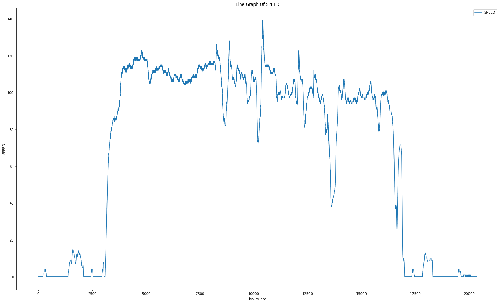
    


    
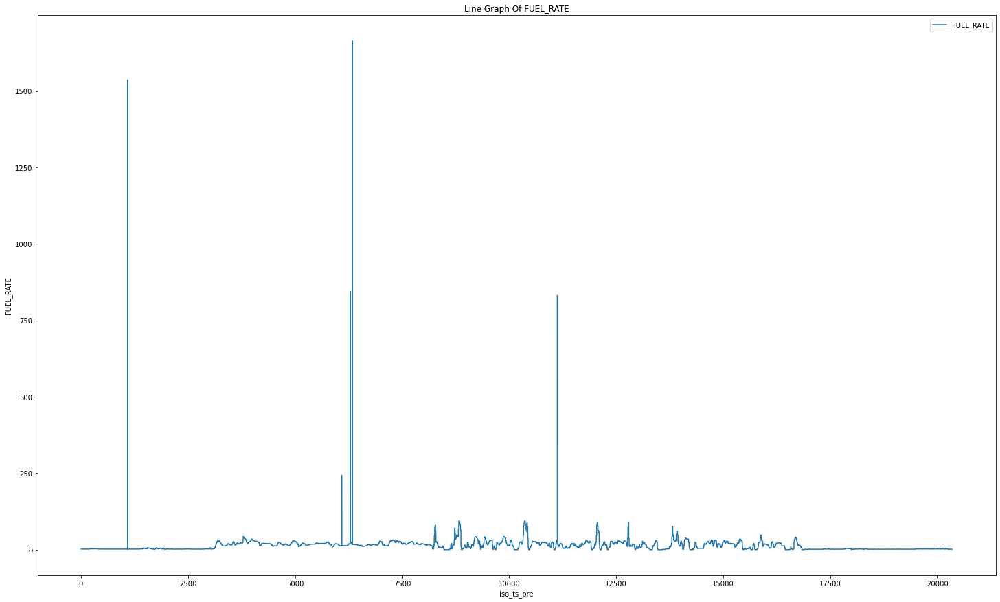
    


```python
col = 'FUEL_RATE'
plt.close("all")
plt.figure(figsize=(25,15))

df_not_null = (df[df[col].notnull()])
(df_not_null[df_not_null.FUEL_RATE < 100]).plot(kind='line', title=f"Line Graph Of {col} < 100",
                                        y=col, ylabel=col,
                                        x='iso_ts_pre', xlabel='iso_ts_pre',
                                        legend=True)

plt.show()
#plt.savefig(f"DataValidation/cycle/line/{col}_LT_100.png",
#            dpi=1200, facecolor='w', edgecolor='w', orientation='landscape',
#            format=None, transparent=True, bbox_inches=None, pad_inches=0.2, metadata=None)
```


    <Figure size 1800x1080 with 0 Axes>


    

    


```python
# create line graph for each numeric column
# Normalize column values using min/max method
def minmax_norm(tdf):
    return (tdf - tdf.min()) / ( tdf.max() - tdf.min())

for col in columns:
    df_norm = minmax_norm(df[df[col].notnull()])
    plt.close("all")
    plt.figure(figsize=(25,15))
    (df_norm[col]).plot(
        kind='line', title=f"Normalized Line Graph of {col}",
        y=col, ylabel=col,
        x='iso_ts_pre', xlabel='iso_ts_pre',
        legend=True)

    plt.show()
#    plt.savefig(f"DataValidation/cycle/line-normalized/{col}.png",
#            dpi=1200, facecolor='w', edgecolor='w', orientation='landscape',
#            format=None, transparent=True, bbox_inches=None, pad_inches=0.2, metadata=None)
```


    
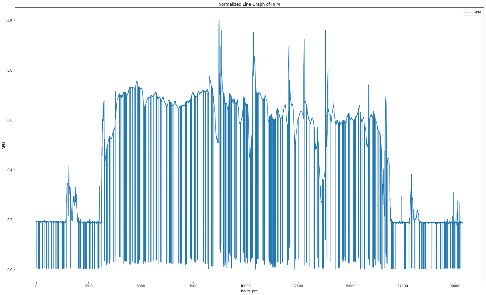
    


    
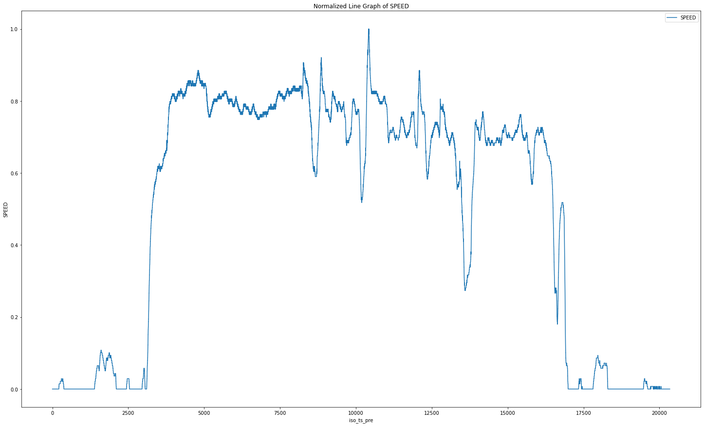
    


    

    


```python
# Histogram
# create histogram for each numeric column
for col in columns:
    plt.close("all")
    plt.figure(figsize=(25,15))
    ((df[df[col].notnull()])[col]).plot(
        kind='hist', title=f"Histogram Of {col}",
        xlabel=col, bins=20, legend=True)

    plt.show()
#    plt.savefig(f"DataValidation/cycle/hist/{col}.png",
#            dpi=1200, facecolor='w', edgecolor='w', orientation='landscape',
#            format=None, transparent=True, bbox_inches=None, pad_inches=0.2, metadata=None)
```


    
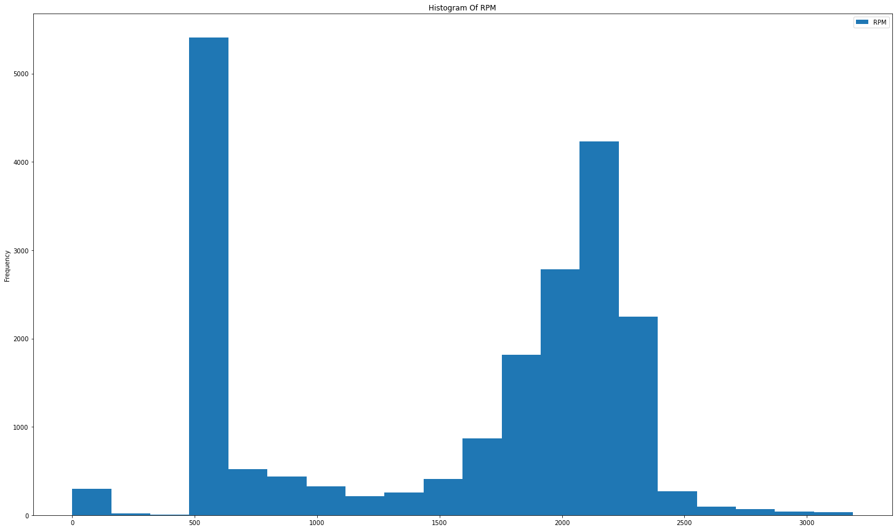
    


    
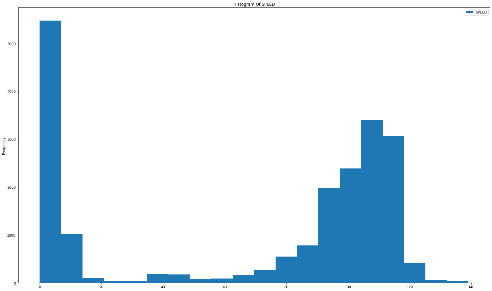
    


    
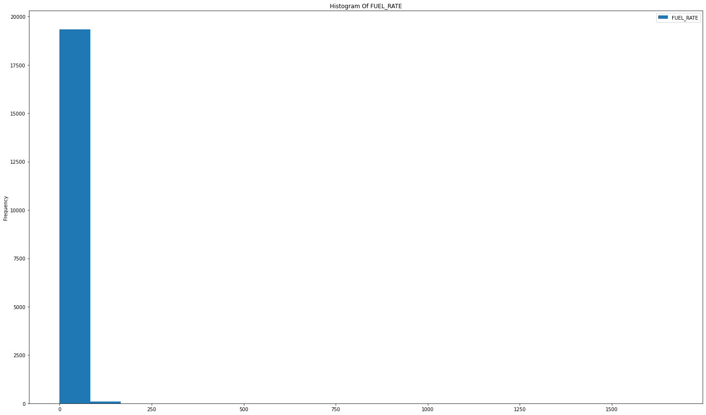
    


```python
# Histogram
# create histogram for each numeric column
# create line graph for each numeric column
col = 'FUEL_RATE'
plt.close("all")
plt.figure(figsize=(25,15))
# ((df[df[col].notnull()])[col]).plot(kind='line', title=f"Line Graph Of {col}",
df_not_null = (df[df[col].notnull()])
(df_not_null[(df_not_null[col] < 100)])[col].plot(
        kind='hist', title=f"Histogram Of {col} < 100",
        xlabel=col, bins=20, legend=True)

plt.show()
# plt.savefig(f"DataValidation/cycle/hist/{col}_LT_100.png",
#            dpi=1200, facecolor='w', edgecolor='w', orientation='landscape',
#            format=None, transparent=True, bbox_inches=None, pad_inches=0.2, metadata=None)
```


    
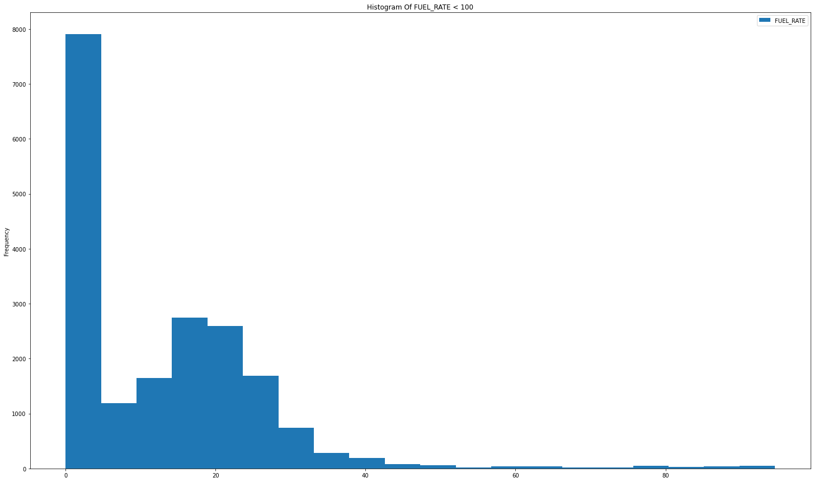
    


```python
# Scatter
# create scatter plot for each pair (x,y) of columns where x and y are not the same column name
for xcol in columns:
    for ycol in columns:
        if xcol == ycol:
            continue
        plt.close("all")
        plt.figure(figsize=(25,15))
        ((df[df[xcol].notnull()])).plot(
            kind='scatter', title=f"Scatter Plot of {ycol} and {xcol}",
            y=ycol, ylabel=ycol, x=xcol, xlabel=xcol, legend=True)

        plt.show()
#        plt.savefig(f"DataValidation/cycle/scatter2/{ycol}-{xcol}.png",
#            dpi=1200, facecolor='w', edgecolor='w', orientation='landscape',
#            format=None, transparent=True, bbox_inches=None, pad_inches=0.2, metadata=None)
```


    <Figure size 1800x1080 with 0 Axes>


    

    


    <Figure size 1800x1080 with 0 Axes>


    
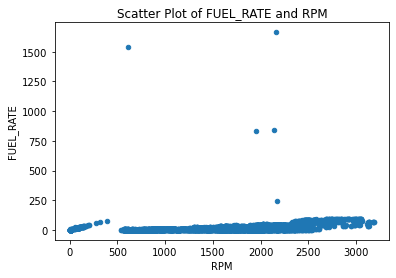
    


    <Figure size 1800x1080 with 0 Axes>


    

    


    <Figure size 1800x1080 with 0 Axes>


    
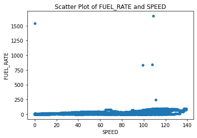
    


    <Figure size 1800x1080 with 0 Axes>


    
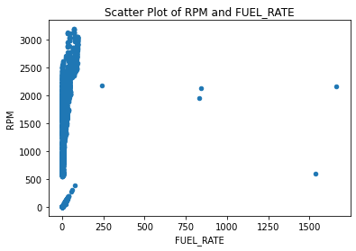
    


    <Figure size 1800x1080 with 0 Axes>


    
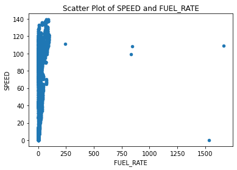
    


```python
# Scatter
# create scatter plot for each triplet (x,y, z) of columns where x, y and z are distinct column names
def xyz_not_unique(x:list)->bool:
    return len(x) > len(set(x))

plt.close("all")

for xcol in columns:
    for ycol in columns:
        for zcol in columns:
            if xyz_not_unique([xcol,ycol,zcol]):
                continue
            plt.close("all")
            plt.figure(figsize=(25,15))
            ((df[df[xcol].notnull()])).plot(kind='scatter', title=f"Scatter Plot of {xcol}, {ycol} and {zcol}",
                        x=xcol, xlabel=xcol, y=ycol, ylabel=ycol, c=zcol, cmap='gray_r', legend=True)
            
            plt.show()
#            plt.savefig(f"DataValidation/cycle/scatter3/{xcol}-{ycol}-{zcol}.png",
#                        dpi=1200, facecolor='w', edgecolor='w', orientation='landscape',
#                        format=None, transparent=True, bbox_inches=None, pad_inches=0.2, metadata=None)
```


    <Figure size 1800x1080 with 0 Axes>


    

    


    <Figure size 1800x1080 with 0 Axes>


    
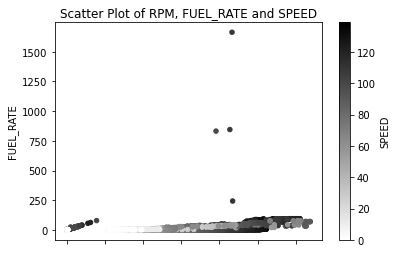
    


    <Figure size 1800x1080 with 0 Axes>


    
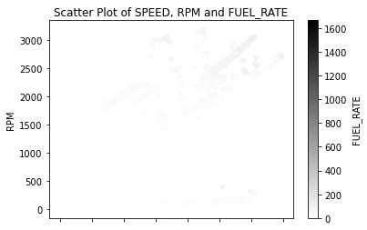
    


    <Figure size 1800x1080 with 0 Axes>


    
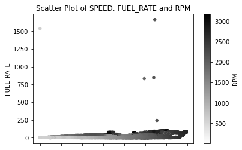
    


    <Figure size 1800x1080 with 0 Axes>


    
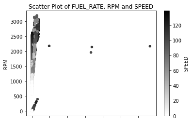
    


    <Figure size 1800x1080 with 0 Axes>


    
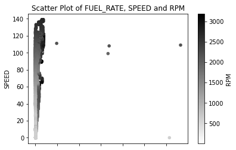
    


```python
# Scatter
plt.close("all")

xcol = 'FUEL_RATE'
ycol = 'SPEED'
zcol = 'RPM'

plt.figure(figsize=(25,15))
df_not_null = (df[df[col].notnull()])
(df_not_null[((df_not_null[col] < 100) & (df_not_null[ycol] > 10) & (df_not_null[zcol] > 700))]).plot(kind='scatter',
                        title=f"Scatter Plot of {xcol} < 100, {ycol} > 10 and {zcol} > 700",
                        x=xcol, xlabel=xcol, y=ycol, ylabel=ycol, c=zcol, cmap='Greens', legend=True)
            
plt.show()
#plt.savefig(f"DataValidation/cycle/scatter3/{xcol}-LT-100-{ycol}-GT_10-{zcol}_GT_700.png",
#            dpi=1200, facecolor='w', edgecolor='w', orientation='landscape',
#            format=None, transparent=True, bbox_inches=None, pad_inches=0.2, metadata=None)
```


    <Figure size 1800x1080 with 0 Axes>


    
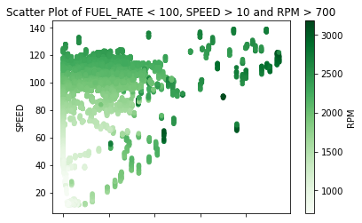
    


```python
# Scatter
plt.close("all")

xcol = 'RPM'
ycol = 'SPEED'
zcol = 'FUEL_RATE'

plt.figure(figsize=(25,15))
df_not_null = (df[df[col].notnull()])
(df_not_null[((df_not_null[zcol] < 100) & (df_not_null[ycol] > 10) & (df_not_null[xcol] > 700))]).plot(kind='scatter',
                        title=f"Scatter Plot of {xcol} > 700, {ycol} > 10 and {zcol} < 100",
                        x=xcol, xlabel=xcol, y=ycol, ylabel=ycol, c=zcol, cmap='Greens', legend=True)
            
plt.show()
#plt.savefig(f"DataValidation/cycle/scatter3/{xcol}-GT-700-{ycol}-GT-10-{zcol}-LT-100.png",
#            dpi=1200, facecolor='w', edgecolor='w', orientation='landscape',
#            format=None, transparent=True, bbox_inches=None, pad_inches=0.2, metadata=None)
```


    <Figure size 1800x1080 with 0 Axes>


    
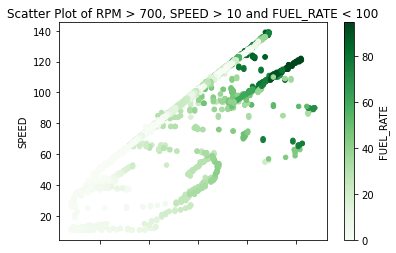
    


```python
# Scatter
plt.close("all")

xcol = 'RPM'
ycol = 'FUEL_RATE'
zcol = 'SPEED'

plt.figure(figsize=(25,15))
df_not_null = (df[df[col].notnull()])
(df_not_null[((df_not_null[ycol] < 100) & (df_not_null[zcol] > 10) & (df_not_null[xcol] > 700))]).plot(kind='scatter',
                        title=f"Scatter Plot of {xcol} > 700, {ycol} < 100 and {zcol} > 10",
                        x=xcol, xlabel=xcol, y=ycol, ylabel=ycol, c=zcol, cmap='Greens', legend=True)
            
plt.show()
#plt.savefig(f"DataValidation/cycle/scatter3/{xcol}-GT-700-{ycol}-LT-100-{zcol}-GT-10.png",
#            dpi=1200, facecolor='w', edgecolor='w', orientation='landscape',
#            format=None, transparent=True, bbox_inches=None, pad_inches=0.2, metadata=None)
```


    <Figure size 1800x1080 with 0 Axes>


    

    


```python
# Scatter
plt.close("all")

xcol = 'SPEED'
ycol = 'FUEL_RATE'
zcol = 'RPM'

plt.figure(figsize=(25,15))
df_not_null = (df[df[col].notnull()])
(df_not_null[((df_not_null[zcol] > 700) & (df_not_null[ycol] < 100) & (df_not_null[xcol] > 10))]).plot(kind='scatter',
                        title=f"Scatter Plot of {xcol} > 10, {ycol} < 100 and {zcol} > 700",
                        x=xcol, xlabel=xcol, y=ycol, ylabel=ycol, c=zcol, cmap='Greens', legend=True)
            
plt.show()
#plt.savefig(f"DataValidation/cycle/scatter3/{xcol}-GT-10-{ycol}-LT-100-{zcol}-GT-700.png",
#            dpi=1200, facecolor='w', edgecolor='w', orientation='landscape',
#            format=None, transparent=True, bbox_inches=None, pad_inches=0.2, metadata=None)
```


    <Figure size 1800x1080 with 0 Axes>


    

    

## LICENSE

[MIT License](../LICENSE.md)
